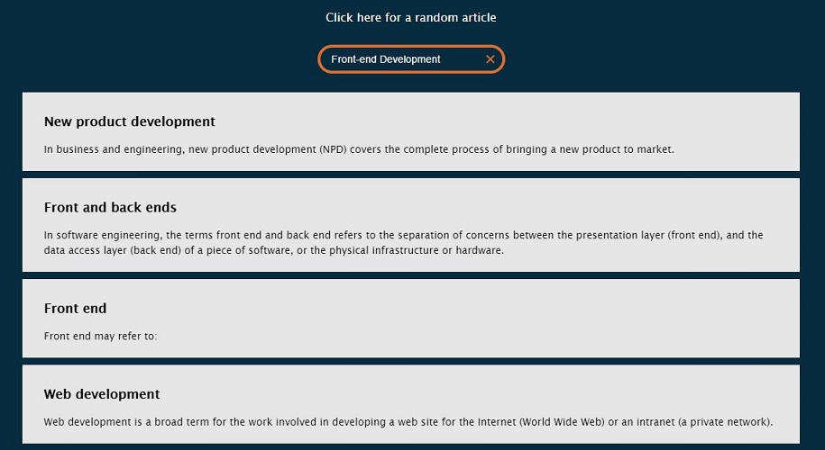

## Free Code Camp - Build A Wikipedia Viewer

In this freecodecamp project, we learn how to build a Wikipedia Viewer.

[View demo site here.](https://webdevtuts.github.io/freecodecamp_wikipedia_viewer/)

